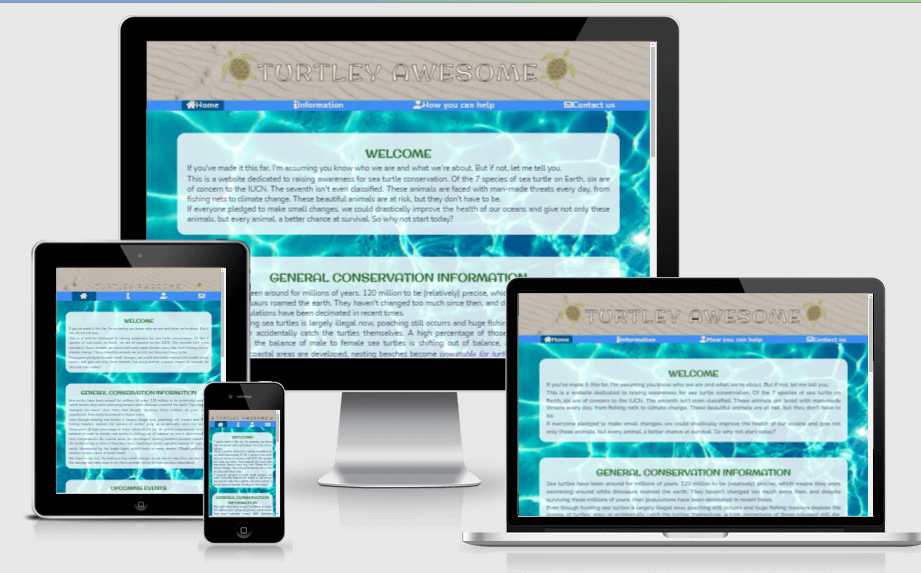
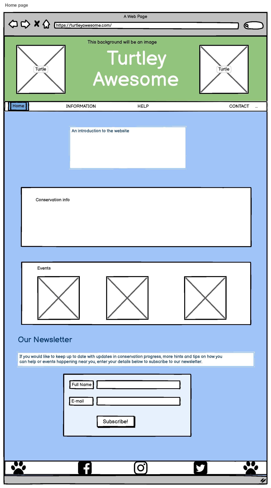
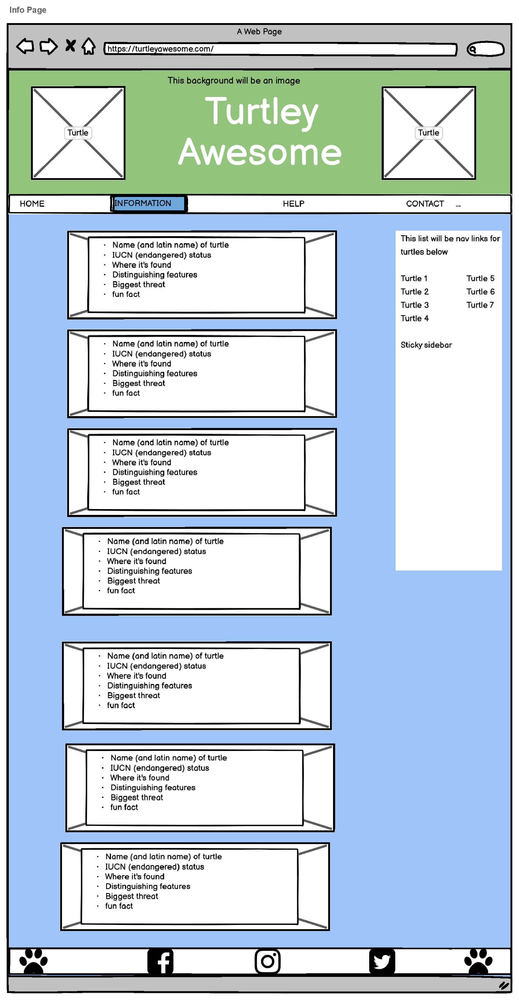
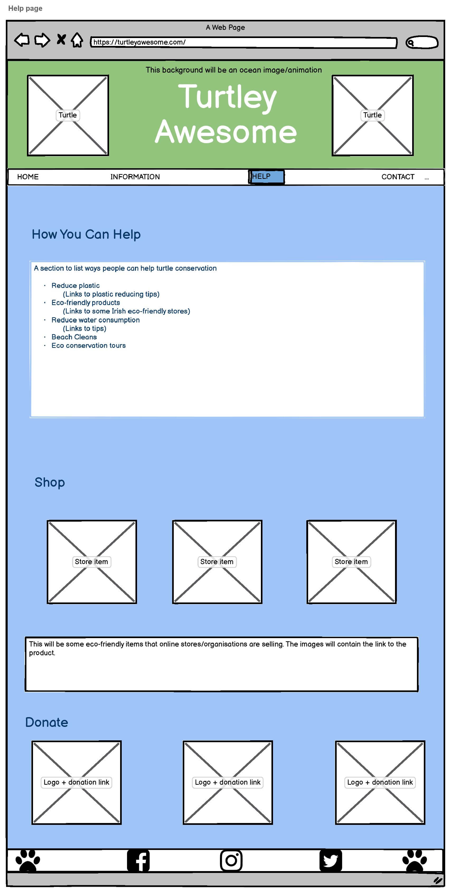
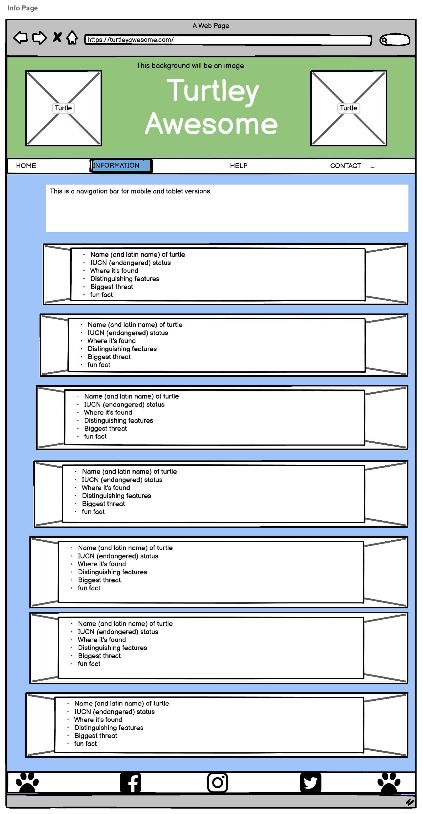
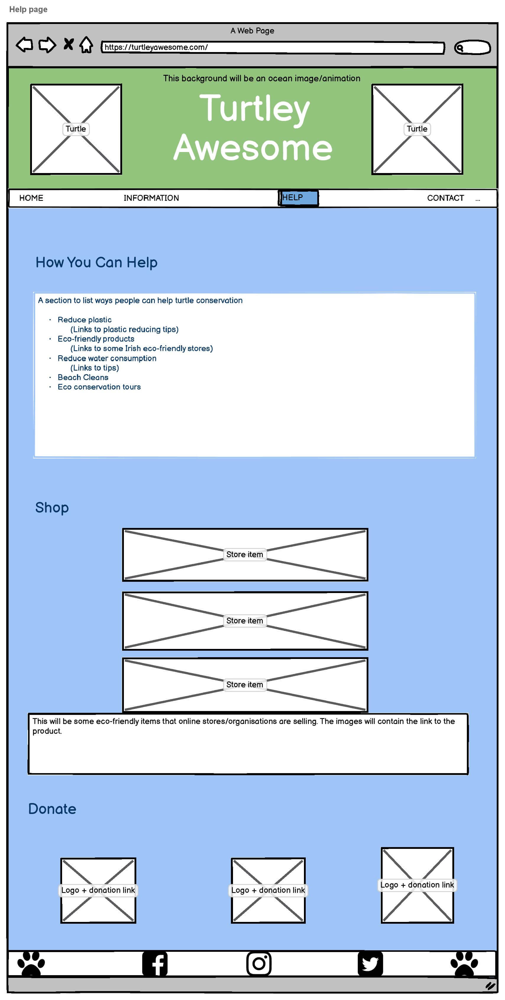
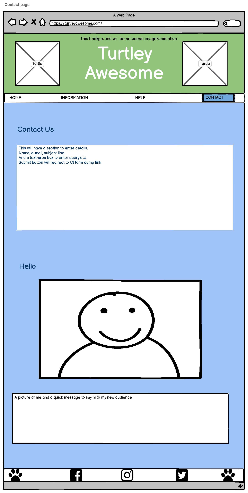

# Turtley Awesome

Live site: [Turtley Awesome](https://hartnetl.github.io/ms1-turtley-awesome/)

## Table of Contents

1. [Introduction](##Introduction)
2. [UXD User Experience Design](##UXD-User-Experience-Design)
3. [Features](##Features)
4. [Technologies Used](##Technologies-and-Resources-Used)
5. [Deployment](##Deployment)
6. [Credits](##Credits)

## Introduction

***

Welcome to Turtley Awesome, a site designed to deliver up to date and comprehensive information on the conservation of sea turtles. It is a place for people to learn about the types of sea turtles, pick up some eco-friendly tips on how they can help with their conservation and join a community of like minded people.  
  

## UXD User experience Design

*** 

This site is aimed at anyone looking to further their knowledge into sea turtle conservation. The information provided is comprehensive and void of technical language, and provides a good starting place to learn about these animals. There are in text links to provide further information on some topics. There is the option to sign up to a newsletter to keep up to date with information, tips and events, as well as social media links in the footer to build a sense of community. The aesthetic of the page is fun and casual, with the intention of making people feel welcome and comfortable reaching out to the page and social media channels.

### Strategy

#### User Goals

Visitors to this site are looking to learn about sea turtle conservation and ways they can help. 

#### Project goals

This website wants to provide a way to deliver information about these sea turtles which need protecting, and convince people it doesn't take much on their part to help. It aims to do this in an easy to understand and aesthetically pleasing way. 

#### User Stories

- Users want to be able to easily navigate between pages.  
- Users want to learn about these animals.
- Users want to keep up to date with related information.
- Users want to be involved with like minded people.
- Users want to know how they can make eco-friendly choices and help save the turtles.
- Users want to be able to contact the people running the page.

- The owners want to provide a pleasant experience for users while learning.
- The owners want to provide fun surprises in the page for users.

### Scope

The aim of this project was to build a static website for visitors to learn about sea turtles. The features used were minimal due to my current level, but used effectively to give an enjoyable expereince. 

The features to include:

- A navigation bar to easily swap between pages.
- A memorable header visible on all pages, which links to the home page.
- A fun and attractive page which captures the users attention.
- Separate pages for different sections of information to reduce page to improve flow of the website.
- An information section which is easy to read, follow and understand to learn about the turtles.
- Links to more detailed information on some points made, that open in new tabs.
- A page dedicated to ways to help the sea turtles after learning about them.
- A contact page, so people can interact with the page itself. To provide feedback, point out errors or out-of-date information or just get in touch with someone with a similar interest. 
- Social media links so people can join a community of people with the same interests and passions.
- Fun easter egg like surprises - clickable turtle icons in the footer leading to external pages.

### Structure 

This page consists of 4 pages to break down the information provided into easy to digest sections. 

All pages: 
A distinct header and navigation bar linking all pages together.
In the footer each social media link leads to the related social media home page. The two turtle icons lead to surprises if the user thinks to click them. The left turtle icon will lead to a turtle hatchling video. The right side turtle icon will lead to a page with an embedded game on it - currently not related to turtle conservation because Flash lost support and that's what a lot of games used.
So a clone version of Flappy Bird is there instead.

Page 1: index.html
An introduction to the website, Turtley Awesome, which is a site aimed at raising awareness to turtle conservation. It will have a general welcome message, a brief overveiw on conservation, an events section and a form to subscribe to the newsletter at the bottom.

Page 2: info.html
The second page will contain general sea turtle information and an explanation of the IUCN red list classifications. The main content will be information on the 7 types of sea turtles, accompanied by a picture of each as the background. A sticky side navigation bar will be included as an aside to direct you to each of the turtle types on desktop and tablet. This disappears on the mobile version and a simpler navigation appears at the top instead. In place of the sticky navigation bar on mobile versions, a "back to the top" button will appear beneath the information to easily return to the top of the page.

Page 3: help.html
Information on how individuals can contribute to the protection and conservation of sea turtles and live a more eco-friendly life.
After this section will be a shop section for eco-friendly items to be advertised.
There will be a section for donations - icons which link to the websites for direct donations.

Page 4: contact.html
This page will just have a contact us section. It will require a name and e-mail to be taken. Drop down bar for:
general enquiry, feedback and technical issues. Placeholder text will be entered into the text box area.

External page 1
The bottom left footer turtle will be clickable. It will lead to a page that has a video of baby turtles. It will open in new tab but won't have any navigation.

External page 2
The bottom right footer turtle will be clickable and leads to a new page with a game. This would have been a turtle game if flash was still supported. Instead Flappy Bird will be used and it can be played on mobile and desktops.

### Skeleton

This website was first designed using pen and paper, and then created into computer wireframes using Balsamiq.

The site was designed with what was supposed to be a very simple design so there were few changes between mobile and desktop versions. In reality this wasn't as simple as I had expected without the use of Bootstrap. However feedback from people who tested my site were overall happy with the design and responsiveness on mobile and desktop versions.

Desktop wireframe pages

Home Page  

Info Page  

Help Page  

Contact Page  

Mobile wireframe pages

Home Page  

Info Page  

Help Page  

Contact Page  

#### Deviations from wireframe

In the info page I decided to add a section on the IUCN redlist classifications as I realised while mentioning the classifciation for each turtle that not everyone would be familiar with the classification breakdown.

At the bottom of pages with long blocks of text I decided to include a link at the bottom, just above the footer, which allows the user to easily navigate back to the top of the page.

## Features

## Technologies and Resources Used

## Testing

## Deployment

## Credits

I chose this project as it is imporant to me personally. Animal conservation is a subject I care deeply about and it's a cause I've always believed in. I've loved turtles since I was a kid and this never went away. In 2016 I went to Cyprus to volunteer with SPOT, a conservation programme for Green Sea Turtles and Loggerheads. I learned a lot during this time, and this site seemed like a good 
opportunity to share this info with people who might not know anything about turtles. I hope to provide some basic understanding of the severity of humanaty's impact on the planet, and by supplying ample links to more information, get people interested and involved.
If even one person changes their behaviour I would call this website a success.

This site will provide a place for people to come and learn about the types of sea turtles, have a place for turtle/eco-friendly events and share tips for living a more eco-friendly life. 

## User Stories 

***

## Features

***

### all pages 

- A logo title which is visible on every page and links to the landing page.  
- A navigation bar at the top of each page that links to every other page.    
- Social media links at the footer of every page 
- The turtle icons in the footer are clickable by the user. The left one links to a turtle related video, the other a game.

### home page

- An events section to keep users interacting with the site, each other and the planet 
- A newsletter section to allow users to sign up and receive tips and event updates direct to their inbox

### info page

- A navigation bar in the information page that links to each turtle's section and a link to return to the top of the page.
- An information page, with sections for each type of turtle and the iucn redlist

### help page

- A tips section to keep readers up to date with easy lifestyle changes they can make to be more eco-friendly, a section highlighting some eco-friendly products and a donation section with links to some turtle conservation projects

### contact page

- A contact us page, with contact form to allow users of the site to contact the site owners with questions or feedback

## Overview of site 

*** 

Page 1: index.html
An introduction to the website, Turtley Awesome, which is a site aimed at raising awareness to turtle 
conservation. It will have a general introduction, a brief overveiw on conservation, an events/webinars 
section and a form to subscrible to the newsletter at the bottom.
In the footer, each social media link leads to the related social media home page. The left turtle icon will
lead to a surprise page with a turtle hatching video. The right side turtle icon will lead to a page with a game
on it - currently not related to turtle conservation because Flash lost support and that's what a lot of games used.
So a clone version of Flappy Bird is there instead.

Page 2: info.html
The second page will contain general sea turtle information and an explanation of the IUCN red list classifications. The main content will be information on the 7 types of sea turtles, accompanied by a picture of each as the background. A sticky side navigation bar will be included as an aside to direct you to each of the turtle types on desktop and tablet. This disappears on the mobile version and a simpler navigation appears at the top instead.

Page 3: help.html
Information on how individuals can contribute to the protection and conservation of sea turtles and live a more eco-friendly life.
After this section will be a shop section for eco-friendly items to be advertised.
There will be a section for donations - icons which link to the websites for direct donations.

Page 4: contact.html
This page will just have a contact us section. It will require a name and e-mail to be taken. Drop down bar for:
general enquiry, feedback and technical issues. Placeholder text will be entered into the text box area.

External page 1
The bottom left turtle will be clickable. It will lead to a page that has a video of baby turtles. 
Open in new tab - no navigation. 

External page 2
The bottom right turtle will be clickable and leads to a new page with a game. This would have been a turtle game if flash was still supported.

## Technologies used

*** 

- HTML5

- CSS

## Deployment

***

- In the github repository "ms1-turtley-awesome" go to the settings tab
- Scroll down to the GitHub Pages section
- Click the link to it's separate page
- Swap source branch from none to master
- Press the save button
- Wait a few minutes while your page is being built before following the link which should now say "Your site is published at ... "

The deployed site: https://hartnetl.github.io/ms1-turtley-awesome/

## Credit

*** 

### Information

While a lot of the information displayed on the website I have gained over the years throughout university and volunteering in Cyprus, I used the following websites to fill in any gaps and verify things I didn't know. 

https://oceana.org/marine-life/sea-turtles-reptiles/       

https://www.iucnredlist.org/search?query=sea%20turtle&searchType=species           

https://www.natgeokids.com/ie/discover/animals/sea-life/green-sea-turtle-facts/          

https://www.barrierreef.org/news/blog/10-fascinating-facts-about-sea-turtles            

https://www.ecowatch.com/9-super-cool-facts-about-sea-turtles-1891175453.html           

https://www.worldwildlife.org/species/  

https://www.fisheries.noaa.gov/species/  

https://oliveridleyproject.org/sea-turtles/sea-turtles-of-the-indian-ocean  

https://www.conserveturtles.org/information-about-sea-turtles-their-habitats-and-threats-to-their-survival/  

### Images

### Code for things I didn't know how to do 

- Adding outline/shadow to text URL        
https://stackoverflow.com/a/4919231  
text-shadow: -1px -1px 0 #000, 1px -1px 0 #000, -1px 1px 0 #000, 1px 1px 0 #000;  

- Side nav bar            
https://www.w3schools.com/howto/howto_css_fixed_sidebar.asp  

- How to blur images         
https://www.w3schools.com/howto/howto_css_blurred_background.asp  

- How to make IUCN redlist bar              
https://jsfiddle.net/Pugazh/uf3fk17g/  

- How to make font-size more responsive            
https://bits.theorem.co/css-pro-tips-responsive-font-sizes-and-when-to-use-which-units/
