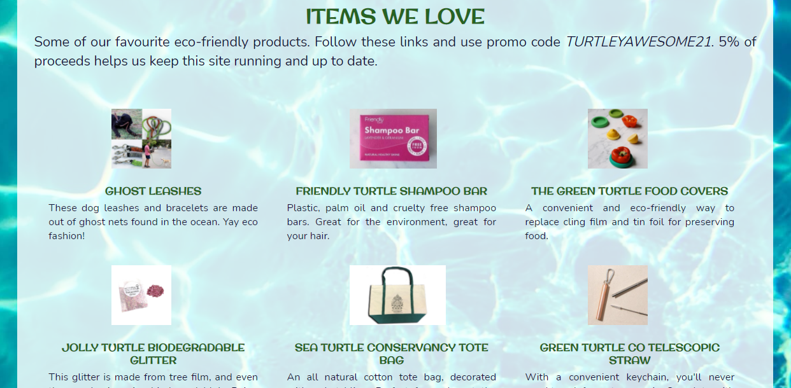

# Turtley Awesome

Live site: [Turtley Awesome](https://hartnetl.github.io/ms1-turtley-awesome/)

Project Aim: To design a static website using pure HTML and CSS, without the use of Bootstrap or other frameworks.

1. [Introduction](#introduction)
2. [UXD User Experience Design](#uxd-user-experience-design)
    - [Strategy](#strategy)
    - [Scope](#scope)
    - [Structure](#structure)
    - [Skeleton](#skeleton)
    - [Surface](#surface)
3. [Features](#Features)
    - [Exisiting](#existing-features)
    - [Future](#future-features)
4. [Technologies Used](#technologies-and-resources-used)
5. [Issues faced](#issues-faced)
6. [Testing](#testing)
    - [Validation](#validator-tests)
    - [Manual](#manual-testing)
    - [Bugs](#bugs)
7. [Deployment](#deployment)
8. [Credits](#credits)

## Introduction

***

Welcome to Turtley Awesome, a site designed to deliver up-to-date and comprehensive information on the conservation of sea turtles. It is a place for people to learn about the types of sea turtles, pick up some eco-friendly tips on how they can help with their conservation, and join a community of like-minded people.  

## UXD User experience Design

***

This site is aimed at anyone looking to further their knowledge of sea turtle conservation. The information provided is comprehensive and void of technical language and provides a good starting place to learn about these animals. There are in-text links to provide further information on some topics. There is the option to sign-up to a newsletter to keep up to date with information, tips, and events, as well as social media links in the footer to build a sense of community. The aesthetic of the page is fun and casual, with the intention of making people feel welcome and comfortable reaching out to the page and social media channels.

### Strategy

#### User Goals

Visitors to this site are looking to learn about sea turtles. They want to feel welcomed and comfortable joining a community of other people with a similar mindset. They want to learn how they can help undo some of the harm we have caused the planet.

#### Project goals

I chose this project as it is important to me personally. Animal conservation is a subject I care deeply about and it's a cause I've always believed in. I've loved turtles since I was a kid and this never went away. This is what drove me to complete an undergraduate in Zoology and a masters degree in Animal Behaviour and Welfare. In 2016 I went to Cyprus to volunteer with SPOT, a conservation programme for Green Sea Turtles and Loggerheads. I learned a lot during this time, and this site seemed like a good opportunity to share this knowledge with people who might not know anything about turtles. I hope to provide some basic understanding of the severity of humanity's impact on the planet, and by supplying ample links to more information, get people interested and involved.
If even one person changes their behaviour I would call this website a success.

#### User Stories

- Users want to be able to easily navigate between pages.  
- Users want to learn about these animals.
- Users want to keep up to date with related information.
- Users want to be involved with like-minded people.
- Users want to know how they can make eco-friendly choices and help save the turtles.
- Users want to be able to contact the people running the page.

- The owners want to provide a pleasant experience for users while learning.
- The owners want to provide fun surprises in the page for users.

### Scope

The aim of this project was to build a static website for visitors to learn about sea turtles. The features used were minimal due to my current level, but used effectively to give an enjoyable experience.

The features to include:

- A navigation bar to easily swap between pages.
- A memorable header visible on all pages, which links to the home page.
- A fun and attractive page which captures the user's attention.
- Separate pages for different sections of information to improve flow of the website.
- An information section which is easy to read and understand to learn about the turtles.
- Links to more detailed information that open in new tabs.
- A page dedicated to ways to help the sea turtles after learning about them.
- A contact page, so people can interact with the site runners.
- Social media links so people can join a community of people with the same interests and passions.
- Fun easter egg like surprises - clickable turtle icons in the footer leading to external pages.

### Structure

This page consists of 4 pages to break down the information provided into easy to digest sections.

1. Home page
2. Sea turtle information page
3. How you can help page
4. Contact us page

### Skeleton

This website was first designed using pen and paper and then created into computer wireframes using Balsamiq.

The site was designed with what was supposed to be a very simple design so there were few changes between mobile and desktop versions. In reality this wasn't as simple as I had expected without the use of Bootstrap because this is a fairly 'busy' website. However, feedback from people who tested my site was overall positive about the design and responsiveness on mobile and desktop versions.

All pages:  
A distinct header and navigation bar linking all pages together.
In the footer each social media link leads to the related social media home page. The two turtle icons lead to surprises if the user thinks to click them. The left turtle icon will lead to a turtle hatchling video. The right side turtle icon will lead to a page with an embedded game on it - currently not related to turtle conservation because Flash lost support and that's what a lot of games used.
So a clone version of Flappy Bird is there instead.

Page 1: index.html
An introduction to the website, Turtley Awesome, which is a site aimed at raising awareness of turtle conservation. It has a general welcome message, a brief overview on conservation, an events section and a form to subscribe to the newsletter at the bottom.

Page 2: info.html
The second page contains general sea turtle information and an explanation of the IUCN red list classifications. The main content has information on the 7 types of sea turtles, accompanied by a picture of each as the background. A sticky side navigation bar is included to direct users to each of the turtle types on desktop and tablet. This disappears on the mobile version and a simpler navigation appears at the top instead. In place of the sticky navigation bar on mobile versions, a "back to the top" button appears beneath the information to easily return to the top of the page.

Page 3: help.html
Information on how individuals can contribute to the protection and conservation of sea turtles and live a more eco-friendly life.
After this is a shop section for eco-friendly items to be advertised.
There is a section for donations - icons which link to the websites for direct donations.

Page 4: contact.html
This page has a contact us section. It requires a name and e-mail to be taken. Dropdown bar for:
general enquiry, feedback, and technical issues. A picture of me and a welcome message is included.

External page 1
The bottom left footer turtle is clickable. It leads to a page that has a video of baby turtles. It opens in a new tab but doesn't have any navigation.

External page 2
The bottom right footer turtle will be clickable and leads to a new page with a game. This would have been a turtle game if flash was still supported. Instead Flappy Bird will be used and it can be played on mobile and desktops.

Click to reveal wireframe pages

Home Page  

Info Page  

Help Page  

Contact Page  

 

Notes about the wireframe:  
The paw icons in the footer represent the turtle icons that link to external pages.  
The nav bar headings change to icons on mobile devices.

#### Deviations from wireframe:

On the information page I decided to add a section on the IUCN redlist classifications. I realised that not everyone understands the system, which would make mentioning the classification without explaining the system redundant.

At the bottom of pages with long blocks of text I decided to include a link at the bottom, just above the footer, which allows the user to easily navigate back to the top of the page. I also included this link at the bottom of each turtle information section on mobiles.

### Surface

#### Aesthetic

I decided to design this page with a sense of juxtaposition. The style of the website is casual, fun and almost child-like. Its design reflects the beach which evokes positive emotions from the average person. Corners of boxes have been softened to maintain a soft flow. This soft, almost juvenile design is a contrast against the harsh reality of the content which describes the critical status of sea turtles and the need to make changes to save them.

#### Colours

The colours running through the page are designed to reflect a beach theme. The header, footer and fieldset boxes contain images of sand. The body background image is water. The body fonts are mostly blue against a white background to increase contrast but reflect clouds in the sky. There are titles in green to reflect plant life on beaches, and turtles are often depicted in green in icons, emojis etc. so it reflects this too.

#### Fonts

The title font used is 'Orginal Surfer' a cursive font from Google Fonts. It brings an element of fun to the typography.

The body font used is 'Nunito', a sans-serif font which provides contrast and ease of reading for the main text.

#### Imagery

The images used in this website are used to bring an element of fun to the site, and really capture the beach and coastal theme associated with sea turtles. Background images were used for the events section to make them a bit more appealing. Background images were used for the turtle information sections to show users the turtles being discussed and enhance the written content. The final image of myself with the green sea turtle on the contact page is designed to capture that sense of community and familiarity and make people more comfortable using the contact box.

## Features

***

### Existing Features:

- User story: Users want to be able to easily navigate through the site and between pages.  
    - Associated feature: A nav bar which is located at the top of each page, linking pages together.

    

    - Associated feature: On mobile the navbar shrinks so the text isn't visible, just the associated icons.  
     
    

    
    

    - Associated feature: A link at the bottom of the page to redirect users back to the top of the page.  

    

    - Associated feature: A navigation bar in the information page which links to each turtle. This is a sticky sidebar in desktop, and a top navigation bar for mobiles.  
     
    
    
      
- User story: Users want to learn about these animals.
    - Associated feature: A comprehensive information page with information on all 7 types of sea turtle.  
    
    

- User story: Users want to keep up to date with related information.
    - Associated feature: An events section which displays important upcoming events, from webinars to fundraising days.
    

    - Associated feature: A newsletter sign-up box which sends out information directly to users.
    

- User story: Users want to be involved with like-minded people.
    - Associated feature: Social media links at the bottom of each page to join the community on Facebook, Instagram and Twitter.
    

- User story: Users want to be able to contact the people running the page.
    - Associated feature: A contact form to allow users to contact the site runners
    

- User story: Users want to know how they can make eco-friendly choices and help save the turtles.
    - Associated feature: A help page, which gives out some easy to make changes to help ocean and turtle conservation.
    
    
    
    - Associated feature: Direct donation links to organisations working on sea turtle conservation for those in a position to use them.
    

- User story: The owners want to provide fun surprises in the page for users.
    - Associated feature: Hidden external links in the footer turtle icons that link to a video on the left site, and a game on the right.
    

    
    

    
    

### Future Features:

- A newsletter submission form which is functional and creates a database instead of redirecting to the CI form dump page.
- A navigation bar that scrolls with the page without needing to include the header image and logo and wouldn't disrupt the readability of information.
- A contact us form which is functional instead of redirecting to the CI form dump page.
- Creating a game related to turtles for the surprise footer instead of flappy bird.
- Social media links which redirect to Turtley Awesome pages instead of home pages.
- Use Bootstrap to improve responsivity.

## Technologies and Resources Used

***

### Languages 

[HTML](https://html.com/): HyperText Markup Language. It is the language used as the basis of building websites and provides the main structure and format to the site.

[CSS](https://www.w3.org/Style/CSS/Overview.en.html): Cascading Style Sheets. It's the language used to make the web elements look better. It adds colour, positioning, fonts etc.

### Programmes and Libraries Used

- [Balsamiq](https://balsamiq.com/tutorials/) - used to build framework.
- [Chrome devtools](https://developer.chrome.com/docs/devtools/) used for finding quick solutions to design issues and visualising the site on different screen sizes for making media queries.
- [Font Awesome](https://fontawesome.com/) was used to source social media icons
- [Git](https://git-scm.com/) used for version control of my site and pushing code to GitHub
- [GitHub](https://github.com/) is the cloud storage system for my projects. The location of this site's repository, and place to deploy site.
- [GitPod](https://gitpod.io/) - the IDE used to write and preview the code for this website.
- [TinyJPG](https://tinypng.com/) is the site used to compress images used without compromising the quality.

### A note on bootstrap

While I know bootstrap was allowed to be used in this project, as a student on the 5P course Bootstrap isn't introduced until our fourth project. I decided for my first project I would take on the challenge of designing a responsive website without the help of bootstrap, as I feel that it was omitted at this early stage for a reason. My guess would be that was to give a better insight into media queries, and getting a unique experience of building something with pure html and css. I understand that this comes with the risk of a lower grade on this project as my responsivity will be lesser than if I used a framework such as bootstrap, but I really think doing this project without it has helped me understand the complexities and difficulties of web design, positioning and responsiveness. However, I am certainly looking forward to using it in my future projects.

### Resources for code

As a beginner, my project was mostly designed using code provided in the Code Institute lessons and example projects.
I also referenced [w3schools](https://www.w3schools.com/), [stackoverflow](https://stackoverflow.com/) and [CSS tricks](https://css-tricks.com/) for general hints.[flexbox froggy](https://flexboxfroggy.com/) was a great tool for understanding the CSS flexbox.

## Testing

***

### Validator Tests

- HTML was validated using [W3C markup validator](https://validator.w3.org/).  
On my first validation test it returned multiple errors. These were all minor, and all were fixed so the code now runs without errors or warnings. The errors were related to an unclosed element and extra closing anchor tags which had been mistakenly left in.

- CSS was validated using [W3C CSS validator](https://jigsaw.w3.org/css-validator/).  
This returned no errors on my first validation test.

### Link validation 

- Links were tested with [W3C Links validator](https://validator.w3.org/checklink).  
The only fault that returned on this test was that facebook.com due to robot exclusion rules. I tested this link manually instead and it opened in a new tab as expected.

### Accessibility test

- Accessibility of the site was tested with [WAVE(Web Accessibility Evaluation Tool)](https://wave.webaim.org/).  
This test returned no errors or contrast errors, but multiple alerts. These were in relation to a table used for structure, justified text and skipped headers. These have the potential to disturb the accuracy of screen readers but when tested they worked fine.

### Performance test

- Performance was tested with [lighthouse](https://developers.google.com/web/tools/lighthouse/run) ([results](assets/readme-files/performance.png)) and [webpage test](https://www.webpagetest.org/) ([results](assets/readme-files/performance-2.png)).

### Manual testing

The live link was sent to multiple people for feedback on functionality, ease of navigation and accessibility. 

#### Features on each page:

- Title Logo: Should appear at the top of every page and always link to the home page. Tested and works as expected by every user.
- Navbar: Each page should link to every other page. It should be clear which page the user is on (the background of current page is a different colour). Tested and works as expected.
- On pages with the back-to-top button it should be clearly visible and redirects to the top of the page. Tested and works as expected.
- Site should be appealing to users: Feedback from users was very positive, and they liked the beach theme running through every page. My test group had users with mild visual impairments and/or colour blindness. No issues were reported with readability.
- In-text links to external sources of information should be obvious to see, and redirect to a new tab and display appropriate web page information. Testers said the change in font and italicising of text made these links easy to spot, and they open in a new page to related web page as expected.
- Social media links: Icons should be clearly visible in the footer and redirect to corresponding social media's home page in a new tab. Tested and works as expected for all but one user (more info on that below).
- Clickable turtle icons: The turtle icon should redirect to a new tab with a surprise feature on each. Half of the testers found the links, the other half didn't. This is the desired reach for this feature. I told the ones who didn't find it so they could test it, and they were pleasantly surprised to learn about it and laughed at their inability to find it. All testers clicked the links and they work as expected.
    - Left turtle icon: Video should display on all device sizes. Controls should be visible on the video. Video shouldn't autoplay. Tested and works as expected.
    - Right turtle icon: Game should be visible on all device sizes and be playable. This works as expected. As this is an embedded game, there is no way to control the volume at my current skill level. Users who played the game on headphones reported it was a bit loud. Since there seems to be no way for me to rectify this at this stage but I still wanted to include the game, I put in a note on the page of the game that the volume is loud on headphones.

#### Home page features:

- Events section: Text should be easy to read in front of image, and should resize from desktop to mobile. On the first test, users said the shadowing made the text difficult to read. I changed this for the stroke effect instead and all testers reported no issues with text readability after this.
- Newsletter form: Form should submit to CI dump page. Name and e-mail is required to submit. Error message will display for users not entering name and email in correct format. Tested and works as expected.

#### Information page feature:

- Side navigation bar on desktop should scroll with the text, not block any text, be easy to read and each link should redirect to the correct section on the page. Initially I designed this bar to have an almost invisible background with dark blue text, which became opaque when hovered over. However a couple of users mentioned they didn't even notice it until they accidentally hovered over it. I decided to improve UX to make the background opaque all the time and users subsequently reported they could easily see and use it.
- Navigation bar on mobile should correctly redirect to each turtle section. Tested and works as expected. Users were asked if they found not having a navigation bar throughout the page hindered the experience of that page, but no users had a problem with this. The navigation of the page is easy to follow and the back-to-top button at the bottom allows users to easily navigate back to the top.

#### Help page features:

- Images should resize depending on size of device used. Tested and works as expected.
- Links embedded in images should redirect to associated link in a new tab. Tested and works as expected.

#### Contact page features:

- Form submission should redirect to CI form dump page in a new tab. Tested and works as expected.
- Name, e-mail and subject should be required to submit form. Tested and works as expected.
- Picture and message from author: users responded without prompt that they liked the addition of this section as it added an extra welcoming feel and made it more personal. When then asked if they would be more likely to interact with either the community or the page, all but one user who mentioned this feature said yes. So this feature has met the desired response for users.

#### Bugs

- One user reported that the social media icons were not visible in the footer on the desktop. They were visible for this user on their phone, using normal mobile and desktop display on the chrome app. I have no idea why this occurred or how to fix it, and neither do they despite a background in software development themselves.

## Issues Faced

***

- Responsiveness
    - The laptop I am using to complete this project is quite small (screen diameter 10 inches) which has made designing the site for larger screens more difficult.
    - Without the use of Bootstrap I found my media queries quite difficult to make the website respond correctly on different devices. I used Chrome DevTools to set my breakpoints for different devices, using the iPad Pro, iPad, Galaxy S5 and iPhone 5 settings to set my media queries. When I tested these on devtools they looked great across the devices, but when I tested them on an actual phone, tablet etc. they didn't always respond the way I expected. This meant making minor adjustments in either my CSS code, or adjusting the media query breakpoints. Between myself and my testers the website looked great across all devices, but I'm sure there are some devices that don't respond properly.
    - The textarea element used in the contact us section caused me a bit of trouble, as I wasn't sure how to make it responsive. For some reason I couldn't get it to respond by setting the height and width of the box and I ended up making 4 contact boxes in the html code, and choosing which to display using css. This introduced the issue of the contact form not submitting information entered into the textarea box on any device that wasn't a desktop. I revisited using just one box and getting it to respond with height and width and got it to work.
- Positioning  
I really struggled with positioning at the start of this project. The Love Running example seemed so simple, yet I couldn't position even basic elements the way I wanted on my own project. I went over the lessons and example projects again and again but still struggled to get my layout to work. I could get it looking good using fixed/relative positioning and px units, but obviously that leads to struggles later on when I needed to make this responsive to other screen sizes (like the love running example I did this project desktop-down instead of mobile up). I vented my frustration with responsive positioning on Slack and immediately got responses about using flex instead, something I thought required JS. I used the froggy game on https://www.flexboxfroggy.com/ as suggested and that made things much easier to position.

## Deployment

***

- Sign in to the [GitHub](https://github.com/) website. Go to list of repositories.
- In the github repository section find "ms1-turtley-awesome".
- Go to the settings tab located in the menu running across the top of the repository, denoted by a cog icon.
- Click 'Pages' in the navbar on the left.
- Swap source branch from none to master
- Press the save button
- Wait a few minutes while your page is being built.
- A highlighted banner should be displayed on the page saying "Your site is published at ... " with a tick icon to the left of it.
- The site is now live.

The deployed site: https://hartnetl.github.io/ms1-turtley-awesome/

## Credits

***

### Content

While a lot of the information displayed on the website I have gained over the years throughout university and volunteering in Cyprus, I used the following websites to fill in any gaps and verify things I didn't know.

- https://www.barrierreef.org/news/blog/10-fascinating-facts-about-sea-turtles
- https://www.conserveturtles.org/information-about-sea-turtles-their-habitats-and-threats-to-their-survival/  
- https://www.ecowatch.com/9-super-cool-facts-about-sea-turtles-1891175453.html
- https://www.fisheries.noaa.gov/species/
- https://www.iucnredlist.org/search?query=sea%20turtle&searchType=species
- https://www.natgeokids.com/ie/discover/animals/sea-life/green-sea-turtle-facts/
- https://www.oceana.org/marine-life/sea-turtles-reptiles/
- https://www.oliveridleyproject.org/sea-turtles/sea-turtles-of-the-indian-ocean
- https://www.worldwildlife.org/species/ 

### Images

- Header and footer background image: pexels-aistė-sveikataitė-2886574.jpg  
https://www.pexels.com/photo/sand-formation-in-the-desert-2886574/

- Header turtle icons: hturtle.png  
vectorstock.com ; Image ID 20175065 ; Artist - Aliaksei

- Body background image: pexels-julie-aagaard-1426718.jpg  
https://www.pexels.com/photo/blue-water-wallpaper-1426718/

- Footer turtle icons: turtle.png  
www.flaticon.com/authors/smashicons ; Icon pack: diving

- Social media icons:  
www.fontawesome.com

- Event images: 
    - webinar image: plastic.jpg  
    sea_turtle_and_plastic_bag___Richard_Carey_2048x2048  
    - beach clean image: beach-clean.jpg  
    https://www.istockphoto.com/photo/volunteers-cleaning-the-beach-gm1149083609-310543018
    - fundraiser image: turtle-cake.png  
    https://www.dreamstime.com/royalty-free-stock-photo-turtle-cake-shaped-white-background-image30454335

- Turtle images:  
   - green-swim.jpg  
    https://www.shutterstock.com/image-photo/green-sea-turtle-swimming-above-coral-763135951  

   - loggerhead.jpg  
    Vladimir Wrangel  
    https://www.shutterstock.com/image-photo/loggerhead-sea-turtle-caretta-known-wild-416950789e  

   - leatherback.jpg  
    http://www.freestockphotos.biz/stockphoto/17422  

   - hawksbill.jpg  
    Ed Jenkins  
    https://www.shutterstock.com/image-photo/young-hawksbill-turtle-swimming-along-nassau-1257608299?id=1257608299&irclickid=2DK3ErWKfxyLTuNwUx0Mo3ENUkB219TdXxVqx80&irgwc=1&utm_medium=Affiliate&utm_campaign=Curly%20Eskimo&utm_source=13749&utm_term=photo-search-top&c3ch=Affiliate&c3nid=IR-13749  

   - olive-ridley-turtle.jpg  
    M Watson  
    https://fineartamerica.com/featured/olive-ridley-turtle-m-watson.html  

    - olive-ridley.jpg  
    Pratap Padhi  
    https://www.shutterstock.com/image-photo/turtle-490108852  

   - kemps-ridley.jpg  
    Iriana Munoz  
    https://www.shutterstock.com/image-photo/kemps-ridley-sea-turtle-papagayo-1728605845  

    - flatback.jpg  
    https://otlibrary.com/wp-content/gallery/flatback-sea-turtle/  

- Product images:   
These images are copies of the ones used directly on the websites. They were downloaded locally instead of linking to the live website in case the images are taken down from the website. I don't want the images on my site to break in this instance.
Copyright for these images is owned by the respective websites.

- Donation images:  
All are taken from the websites they lead to, and were downloaded and added locally for the same reason as the product images above.
Copyright for these images is owned by the respective websites.

### Code for things I didn't know how to do

- Adding shadow to text URL:  
https://stackoverflow.com/a/4919231  

- Side nav bar:  
https://www.w3schools.com/howto/howto_css_fixed_sidebar.asp  

- How to blur images:  
https://www.w3schools.com/howto/howto_css_blurred_background.asp  

- How to make IUCN redlist bar:  
https://jsfiddle.net/Pugazh/uf3fk17g/  

- How to make font size more responsive:  
https://bits.theorem.co/css-pro-tips-responsive-font-sizes-and-when-to-use-which-units/
